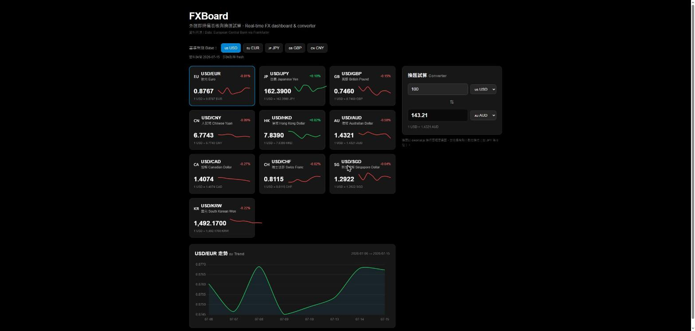
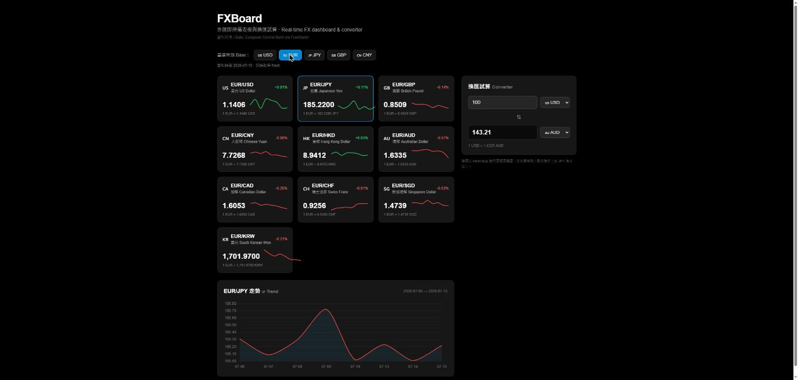
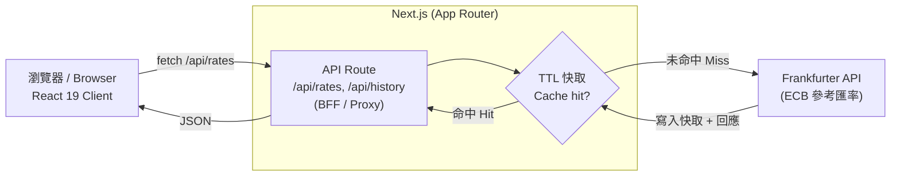
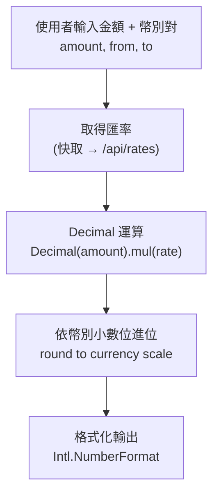

# FXBoard — 外匯即時儀表板與換匯試算 <br/><sub>Real-time FX Dashboard & Currency Converter</sub>

[](https://github.com/seanhong1215/stock-dashboard/actions/workflows/ci.yml)

> 多幣別即時匯率總覽、歷史走勢圖、換匯試算(以 Decimal 處理金額精度),資料透過 Next.js 後端代理 + 快取層取自歐洲央行(ECB)。
> Multi-currency live rates, historical trend charts, and a precision currency converter — data served through a Next.js backend proxy with a cache layer, sourced from the European Central Bank (via the Frankfurter API).

<p>
  
  
  
  
  
  
  
</p>

> ✅ **實作進度 / Status:** 核心已完成 —— 多幣別即時匯率總覽、基準幣別切換、走勢圖、**Decimal 精度換匯試算**、**BFF + TTL 快取層**、錯誤韌性、**Vitest 單元測試(14 項)** 與 **GitHub Actions CI** 皆已實作。標記 🚧 者為 Roadmap 尚未完成項目(匯率警示、即時推播)。此專案由既有股票 demo 重寫而成。
> **Core is implemented**: live multi-currency rates, base switching, trend chart, precision converter, BFF + TTL cache, graceful degradation, 14 unit tests, and CI. 🚧 = still on the roadmap (alerts, realtime push).

---

## 目錄 / Table of Contents

- [專案定位 / Overview](#專案定位--overview)
- [截圖 / Screenshots](#截圖--screenshots)
- [功能亮點 / Features](#功能亮點--features)
- [技術棧與資料來源 / Tech Stack & Data Source](#技術棧與資料來源--tech-stack--data-source)
- [系統架構 / Architecture](#系統架構--architecture)
- [技術決策與取捨 / Engineering Decisions](#技術決策與取捨--engineering-decisions)
- [品質工程 / Quality Engineering](#品質工程--quality-engineering)
- [本機開發 / Getting Started](#本機開發--getting-started)
- [Roadmap](#roadmap)

---

## 專案定位 / Overview

**FXBoard** 是一個外匯(FX)即時儀表板:使用者選擇基準幣別,即時檢視多個幣別對的匯率與 24 小時 / 歷史走勢,並用內建的**換匯試算器**輸入金額換算成目標幣別。所有外部匯率資料經由 Next.js 的 **API Route(BFF / 代理)** 取得,並在後端做 **TTL 快取**,避免前端直接暴露來源、也避免每次載入都打外部 API。

**FXBoard** is a real-time FX dashboard. Users pick a base currency, watch live rates and historical trends across currency pairs, and convert amounts with a built-in **precision converter**. All rate data flows through a Next.js **API Route (BFF/proxy)** with **TTL caching** on the server.

**為什麼是外匯 / Why FX:** 外匯是銀行核心業務之一(外匯櫃檯、財富管理、跨境支付)。本專案聚焦金融軟體最在意的三件事:**即時資料韌性、快取節流、金額精度**。

---

## 截圖 / Screenshots

**基準幣別 USD** — 匯率總覽 grid（旗標 / 貨幣對 / 漲跌 % / 迷你走勢）、換匯試算器、幣別對走勢圖。
_Base = USD: rate grid, converter, and trend chart._



**一鍵切換基準幣別 EUR** — 所有貨幣對與走勢圖即時重算(EUR/USD、EUR/JPY…)。
_Switching base to EUR recomputes every pair and the trend chart live._



---

## 功能亮點 / Features

| 功能 / Feature | 說明 | 狀態 |
|---|---|---|
| 多幣別即時匯率總覽 | 以卡片 grid 呈現主要幣別對即時匯率與漲跌 | ✅ |
| 基準幣別切換 | 一鍵切換 base currency(USD / EUR / JPY / GBP / CNY) | ✅ |
| 歷史走勢圖 | Chart.js 繪製近 8 個交易日走勢 | ✅ |
| 換匯試算器 | 輸入金額 → **Decimal 精度**換算 → 格式化輸出 | ✅ |
| 資料快取與更新時間 | 顯示「資料時間」與快取命中狀態 | ✅ |
| 錯誤韌性 | 外部 API 失敗時保留舊資料 + 提示,不整頁清空 | ✅ |
| 匯率警示 / 即時推播 | 目標匯率到價提醒、SSE/WebSocket 推播 | 🚧 |

---

## 技術棧與資料來源 / Tech Stack & Data Source

| 分類 | 技術 |
|---|---|
| 框架 | Next.js 16(App Router)+ React 19 |
| 語言 | TypeScript 5 |
| 樣式 | Tailwind CSS 4 |
| 圖表 | Chart.js 4(react-chartjs-2) |
| 金額運算 | decimal.js(換匯精度,見下方說明) ✅ |
| 測試 | Vitest(純邏輯單元測試) ✅ |
| 資料來源 | **Frankfurter API**(歐洲央行 ECB 參考匯率,免費、免金鑰、支援歷史區間) |

> 選 Frankfurter 的理由:官方 ECB 資料、免 API 金鑰、支援 `latest` 與 `history` 區間查詢,適合作品集穩定展示;透過後端代理後,未來要換供應商也只需改一處。

---

## 系統架構 / Architecture

### 1. 系統架構圖 / System Architecture

前端不直接打外部 API,而是走 Next.js API Route(BFF pattern)+ 後端 TTL 快取。快取命中直接回應;未命中才向 ECB / Frankfurter 取數並寫入快取。



### 2. 換匯試算資料流 / Conversion Data Flow

換匯的每一步金額運算都走 Decimal,**不使用 JavaScript float**,避免累積誤差。



---

## 技術決策與取捨 / Engineering Decisions

這些是本專案在面試時最值得深談的設計,每一項都對應金融軟體的實務要求:

### 快取 + 節流層 / Caching & throttling
早期 demo 版本在每次切換分頁時,以 `Promise.all` 對 30 個標的**各打一次**外部 API、且**沒有任何快取**——這會浪費請求、觸發速率限制、也拖慢載入。FXBoard 在後端 API Route 加上 **TTL 快取**(匯率變動頻率不高,短 TTL 即可),把「命中即回」變成常態,大幅降低對外部 API 的呼叫次數。

### 金額精度:為什麼金融不能用 float / Why not float
JavaScript 的 `0.1 + 0.2 === 0.30000000000000004`。在換匯、對帳、計息場景,浮點誤差會**累積**成真實的金額差異。FXBoard 的換匯運算改用 **`decimal.js`**(或以最小貨幣單位的整數運算),並依各幣別的小數位數(如日圓 0 位、多數幣別 2 位)進位。這是金融工程的基本功,也是面試常見考點。

### BFF / 代理模式 / Backend-for-Frontend
前端不直接呼叫第三方 API,而是透過 Next.js API Route 代理。好處:**避開 CORS**、隱藏 / 集中管理資料來源、可在後端加快取與速率限制、未來替換供應商只需改一處。此模式沿用了原始 demo 中已驗證可行的 `api/quote` 代理做法。

### 錯誤韌性 / Graceful degradation
外部 API 失敗或回傳缺漏時,**保留前一次成功的資料**並顯示提示,而非整頁清空或崩潰;停市 / 缺值資料點會被過濾。即時資料介面必須具備的降級行為。

---

## 品質工程 / Quality Engineering

> 對應金融單位對「可驗證、可維護」的高度要求。🚧 = Roadmap。

- **單元測試(Vitest)** ✅ — 14 項測試覆蓋純邏輯:換匯計算(含各幣別進位、cross rate、除零防呆)、快取命中/過期(注入假時鐘)。見 `src/lib/convert.test.ts`、`src/lib/cache.test.ts`。
- **GitHub Actions CI** ✅ — push / PR 觸發 `lint → test → build`(`.github/workflows/ci.yml`)。
- **TypeScript 嚴格型別** ✅ — 以型別描述 API 回應與領域模型,降低執行期錯誤。

---

## 本機開發 / Getting Started

```bash
npm install

npm run dev      # 啟動開發伺服器 http://localhost:3000
npm run build    # 正式版打包
npm run start    # 啟動正式版
npm run lint     # ESLint
npm run test     # Vitest（Roadmap）
```

環境變數 / Environment:

```bash
# .env.local（若之後改用需金鑰的 FX 供應商才需要；Frankfurter 免金鑰）
# FX_API_BASE=https://api.frankfurter.dev/v1
```

---

## Roadmap

- [ ] 匯率到價警示(目標匯率提醒)
- [ ] 即時推播:SSE / WebSocket 取代輪詢
- [ ] Vitest 單元測試 + GitHub Actions CI
- [ ] 多語系(i18n)
- [ ] 換匯歷史紀錄與收藏幣別對(需後端持久化)

---

<sub>本專案為個人作品集用途 / For personal portfolio use.</sub>
