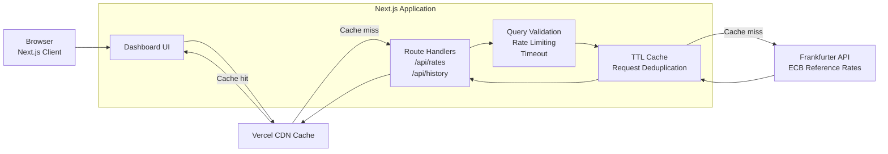
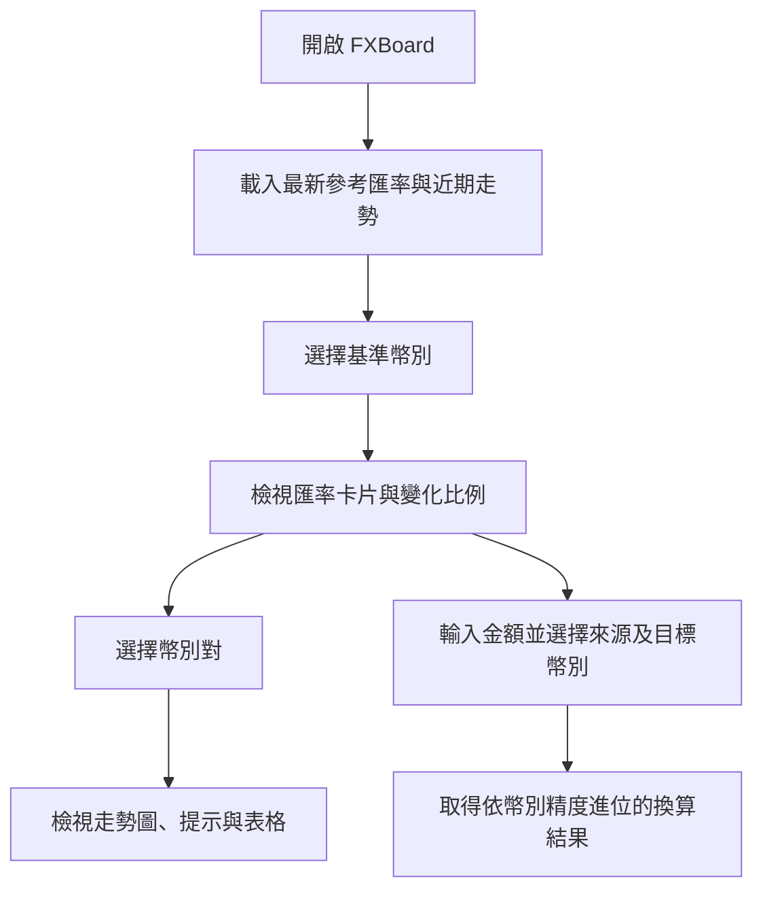

# FXBoard

> Full-stack FX Reference-rate Dashboard & Currency Converter 
> 外匯參考匯率儀表板與換匯試算

## 專案介紹

FXBoard 提供多幣別每日參考匯率、近期工作日走勢與換匯試算。資料來源為 European Central Bank，並透過 Frankfurter API 取得。

系統採用 Next.js App Router 建構前端與 Route Handlers。瀏覽器只呼叫同源 API，由後端負責參數驗證、基本限流、外部資料存取、TTL 快取與統一回應格式。

### 功能結果

- 顯示 USD、EUR、JPY、GBP、CNY、HKD、AUD、CAD、CHF、SGD、KRW 參考匯率。
- 支援 USD、EUR、JPY、GBP、CNY 基準幣別切換。
- 顯示近期工作日匯率走勢、變化比例、圖表提示與表格檢視。
- 支援任意已載入幣別間的換匯試算。
- 使用 decimal.js 處理金額計算與幣別小數位進位。
- 提供亮色、深色與系統主題模式。
- API 提供查詢驗證、外部請求 timeout、基本限流及 CDN cache headers。
- 22 項單元測試通過，production build 通過，production dependencies audit 為 0 vulnerabilities。

### 技術組成

| Layer | Technology |
|---|---|
| Application | Next.js 16, React 19, TypeScript |
| Styling | Tailwind CSS 4 |
| Visualization | Chart.js, react-chartjs-2 |
| Precision | decimal.js |
| Data | ECB reference rates via Frankfurter API |
| Testing | Vitest |
| Deployment | Vercel Hobby |

## 系統架構

### API 回應

| Endpoint | Result |
|---|---|
| `GET /api/rates?base=USD` | 最新參考匯率、資料日期與快取狀態 |
| `GET /api/history?base=USD&days=8` | 各幣別近期工作日時間序列 |
| 無效幣別或查詢範圍 | HTTP 400 |
| 超過基本請求限制 | HTTP 429 |
| 外部資料來源失敗 | HTTP 502 |

## 使用者流程

1. 系統載入預設基準幣別的最新參考匯率與近期工作日資料。
2. 使用者切換基準幣別，匯率卡片、走勢圖與換匯資料同步更新。
3. 使用者選擇幣別卡片，查看對應幣別對的圖表與表格資料。
4. 使用者輸入金額並指定來源與目標幣別，系統輸出換算結果。
5. 外部資料更新失敗時，介面保留本次瀏覽期間最近一次成功資料並顯示狀態。

> ECB/Frankfurter 提供每日參考匯率。資料僅供資訊與技術展示，不構成投資、交易或金融建議；實際換匯價格以金融機構報價為準。
